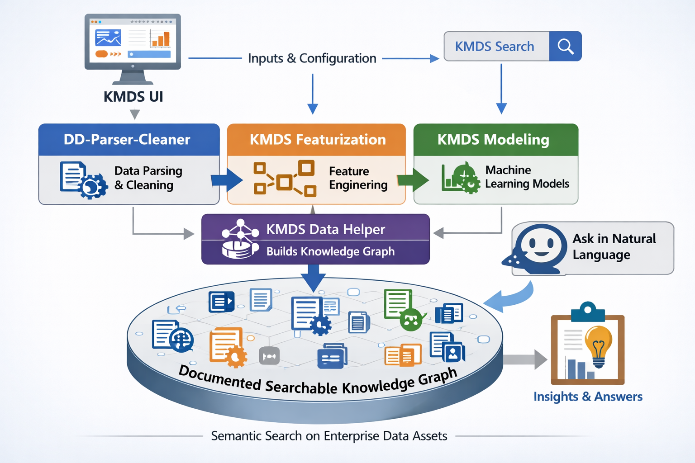

# KMDS Real Dataset Illustrations

This repository demonstrates how the KMDS toolkit applies a consistent solution methodology across multiple real-world projects.

The models in this repository are created by assistants based on modeling prompts. There are modeling assistants for each phase of the project, and they guide the workflow from data understanding through featurization and clustering. Data cleaning and featurization are also performed by assistants, with a human expert in the loop to validate and steer the work.

KMDS does not simply build one-off models. It captures dataset semantics, creates a knowledge-backed cleaning and feature-engineering workflow, and then applies the same structured process to each new dataset. That makes it possible to reuse the same methodology across domains such as finance, retail, and IT service management while still solving the unique business problem for each project.

## Purpose

- Show how KMDS tools support real-world data ingestion, cleaning, and structuring
- Demonstrate end-to-end handling of dataset issues such as missing values, quarantine output, and evolving schema semantics
- Provide a second instantiation of a real dataset workflow using the Olist retail dataset and KMDS modeling artifacts

## Contents

1. The SBA dataset: This dataset is from the SBA. It provides the financial standing of 7a loans guaranteed by the SBA, nationwide. It is published on a monthly schedule and represents an imbalanced classification problem. Please see [this document](https://github.com/rajivsam/kmds_migration/blob/main/sba_migration/documents/sba_development_example_full_doc.md) for a complete description of how a solution is developed for this example. This example is in the financial domain; the same methodology can also be applied to other batch classifiers with similar imbalance characteristics. Examples include:
   1. Churn prediction
   2. Fraud detection
   3. Adverse reaction to a drug
2. The Olist dataset: This dataset is from Olist (sourced from Kaggle). In the supply chain world, segmentation of sales is an important use case; please see [this document](olist_migration/documents/segmentation_as_usecase.md) for the reason machine learning is applied to develop a solution for this model.
3. The ITSM dataset: This dataset is used to develop a survival analysis solution to capture the performance characteristics of various support groups. Details coming soon.

## Why this repository exists

This repository provides an illustration of how machine learning solutions can be replicated following a standard methodology for a range of enterprise problems. While the modeling approach can vary by use case, the process from a documentation, knowledge, and workflow perspective remains standardized. This is not to take away focus from the solution techniques for the individual use case. Constructive feedback and comments are welcome.
