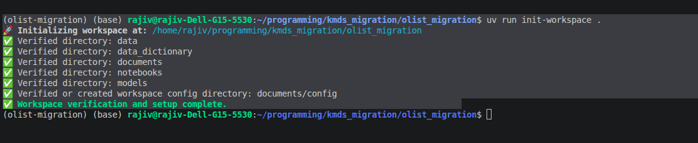
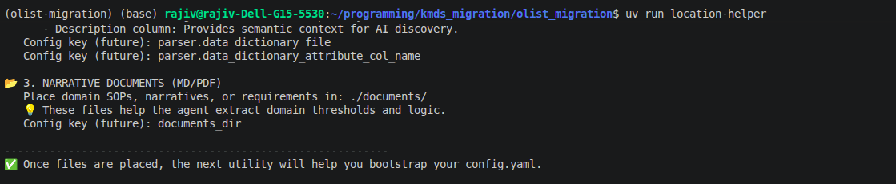
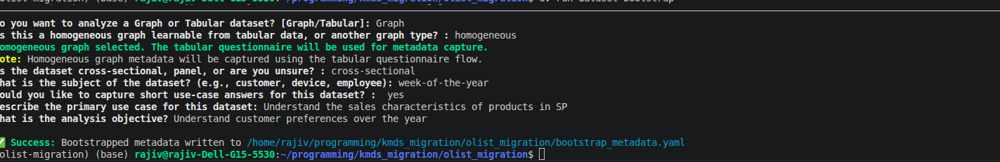
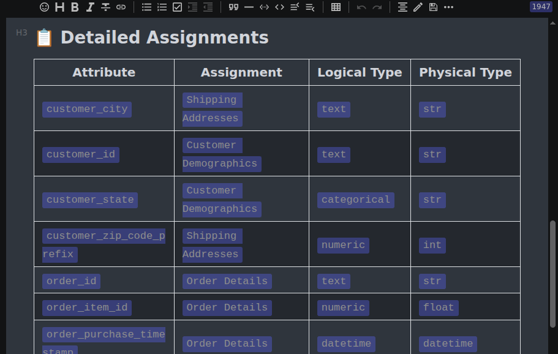

## Creating the Workspace

- The raw datafile is created with [this notebook](../notebooks/raw_datafile_creation.ipynb)
- Workspace is initialized with `uv run init-workspace .`



- Find out where to place the files with `uv run location-helper`



- Answer questions about the dataset



- Run classify entities: `classify-entities`



- Run the clean dataset: `clean-dataset --action full`

## Data preparation and Featurization

A review of the cleaning suggestions indicates that there are a few dangling items in the order-items dataset file, these get dropped anyway. The cleaning suggestion asks us to derive an attribute for the week of the year from the timestamp, we do that. With these actions, the dataset is ready for featurization. You can view the notebook  [here](../notebooks/clean_olist_dataset.ipynb)

The user can ask the agent to discover the interface to the featurizer package with the following code block

```
from featurization import get_package_info

info = get_package_info()
print(info)
```

A featurization advisor that provides the recommend

You can use the following documents in the [agent folder](../agent_documents) to prime the copilot agent to develop the featurization pipeline. The featurization pipeline is listed [here](../notebooks/featurization_workflow.ipynb)


## Modeling

```
from kmds_modeling import get_package_info

info = get_package_info()
print(info)
```

Like with featurization, you can ask the agent to discover the modeling interface with the above block. The documents under the [agent folder](../agent_documents) cover modeling as well. The modeling notebook is available [here](../notebooks/modeling_spectral_clustering.ipynb)
