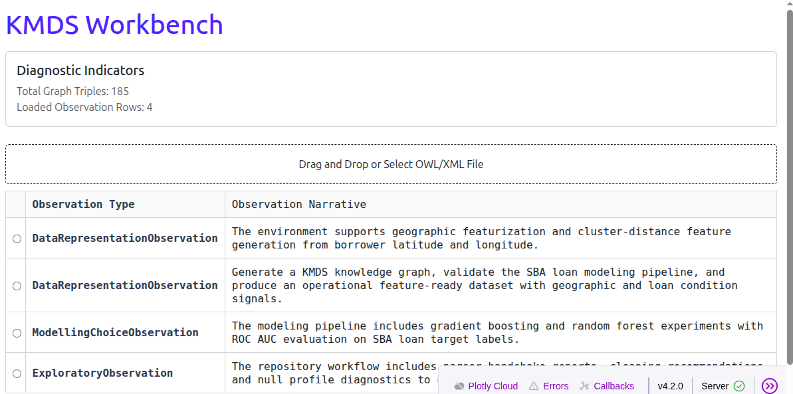

# KMDS Toolkit Summary

- `kmds-modeling`
- `kmds-data-helper`

## The Agent-Human Collaboration: A Real-World Walkthrough

Developing a data science product involves getting answers to a significant number of questions—a number in the low tens is not an unrealistic lower bound for the questions required to build a viable product. These questions are deeply interconnected; getting any one of them wrong translates to a product that fails to deliver the desired result. Furthermore, these questions are often developed and answered by different stakeholders over varying timelines.

As humans, the ownership and responsibility for delivering the product, and taking accountability for its performance, rests entirely with us. However, LLMs are exceptionally well-suited for: (1) retrieving context, (2) generating boilerplate code, and (3) allowing for greater control over behavioral errors when provided with sufficient task resolution.

The KMDS ecosystem leverages these facts to deliver repeatable, auditable, and transparent solutions to data science projects. In the SBA 7(a) loan example, we see this collaboration in action:

### 1. The Semantic Foundation (`dd-parser-cleaner`)

Before a single line of modeling code is written, the human expert defines the **Intent**. Using `dd-parser-cleaner`, the agent ingests the raw SBA data and synchronizes it with a Data Dictionary. The result is a "Handshake Document" that maps raw headers to semantic entities (e.g., tagging `borrcity` as a geographic entity). This ensures the agent understands *what* the data represents before attempting to clean it.

### 2. The Feature Advisor (`kmds-featurizer`)

Once the data is semantically tagged, we invoke the **Feature Advisor**. This service uses an LLM (like Llama 3.2) to provide strategic recommendations. It doesn't just suggest code; it provides a rationale based on the data's logical type.

**Excerpt from SBA Feature Advisor Output:**


| Attribute          | Recommended Method    | Rationale                                                                        |
| :------------------- | :---------------------- | :--------------------------------------------------------------------------------- |
| `borrcity`         | TF-IDF + TruncatedSVD | Short text/keyword-style field. Fit sparse vectors to capture regional patterns. |
| `borrstate`        | Hierarchical Encoding | Geographic long-tail categorical. Preserves spatial hierarchy.                   |
| `naicsdescription` | SentenceTransformer   | Long-form text. Use a pre-trained LLM for semantic embedding.                    |
| `loanstatus`       | Target Encoding       | Use low-count categorical grouping to stabilize the signal.                      |

### 3. The Design-Time Compiler (`kmds-modeling`)

Finally, the project enters the **KMDS Design Governance Framework**. Here, `kmds-modeling` acts as a compiler that prevents architectural anti-patterns before they happen.

## KMDS Design Governance Framework

Machine learning projects often involve a daunting number of modeling choices. For someone who hasn't built a specific type of solution before, this volume of options can be overwhelming. The purpose of the **KMDS Modeling Advisor** is to understand your specific problem and your priorities for the solution. It then provides a clear set of guidelines that you can read, understand, and use alongside a coding assistant to implement your model.

### Supported Modeling Themes

KMDS currently focuses on tabular data and recognizes several commonly encountered modeling themes in enterprise machine learning. When you provide your project details, the assistant assesses whether your problem falls within these supported themes:

1.  **Classification**: Including workflows for imbalanced classification.
2.  **Regression**: Standard prediction of continuous values.
3.  **Graph-based Learning**: 
    *   **Homogeneous Graphs** (single entity types)
    *   **Bipartite Graphs** (two entity types)
    *   **Heterogeneous Graphs** (multiple entity and relationship types)

If your problem is within these themes, the advisor provides tailored guidance. If it isn't currently supported, the assistant will inform you directly so you can plan accordingly. 

Experts can use these guidelines as a standard checklist to ensure best practices, while also having the flexibility to bypass them if a custom approach is required.

## Operational Integration: The Finished Product

The result of this round-trip is a **Design Blueprint**—an expert prompt that the user can hand to any AI coding assistant to generate production-grade code that is guaranteed to follow KMDS governance rules.

**Example SBA Governance Blueprint:**

```text
================== [KMDS DESIGN GUIDANCE: SBA EWS] ==================
PROBLEM CHARACTERISTICS:
- Task: Tabular Classification (Loan Default)
- Imbalance: Moderate (SBA Default Ratios)
- Priority: High Interpretability

DESIGN GUIDELINES:
1. Model: Use a Cost-Sensitive Gradient Boosted Tree with isotonic calibration.
2. Validation: Use Stratified K-Fold to maintain the 'Good/Bad' ratio.
3. Feature Logic: Incorporate Distance-to-Bad-Cluster (hdbc) features derived from geographic tags.

SUGGESTED AI ASSISTANT PROMPT:
"I am building an Early Warning System for SBA loans. 
Following KMDS Governance for moderate imbalance and high interpretability, 
please draft a training script using XGBoost with scale_pos_weight 
and include a calibration step using Isotonic Regression..."
====================================================================
```

By combining human expertise with agent-driven technical governance, the SBA example proves that ML production can be both rapid and remarkably transparent.

## Executive Summary

KMDS is not a single monolithic application. It is a toolkit of related packages and components that together support enterprise-grade machine learning development with auditability, transparency, and clean separation of concerns.

This repository demonstrates the KMDS pattern through a collection of packages that each handle a specific stage of the workflow:

- data ingestion and semantic tagging with `dd-parser-cleaner`
- feature preparation with the KMDS featurizer
- model development with `kmds-modeling`
- repository auditing and metadata extraction with `kmds-data-helper`

These packages define consistent interfaces for producing, validating, and retrieving modeling artifacts for tabular ML projects.

## Responsibilities


| Role                  | Data Scientist                                                                        | KMDS Packages                                                                          | Agent                                                                                  |
| ----------------------- | --------------------------------------------------------------------------------------- | ---------------------------------------------------------------------------------------- | ---------------------------------------------------------------------------------------- |
| Data sourcing         | Decide which raw datasets to use and which sources are trusted                        | Provide directory structure and metadata conventions                                   | Ingest repository content via helper, map sources to tool input paths                  |
| Entity selection      | Choose which entities to featurize, such as geographic or temporal entities           | Offer featurization components that support logical types and domain-specific features | Route the data into the right KMDS package and ensure the right entity types are used  |
| Feature engineering   | Decide how to encode categorical entities, handle missing values, and select features | Implement reusable featurization transforms and target-aware feature logic             | Apply the correct sequence of package operations and preserve separation of concerns   |
| Data cleaning         | Define domain rules and cleaning strategy                                             | Provide parser/cleaner outputs, metadata tags, and recommended cleaning actions        | Coordinate the cleaner stage and produce clean inputs for featurization                |
| Modeling workflow     | Choose algorithms, validation strategies, and model thresholds                        | Provide model evaluation, export interfaces, and artifact serialization                | Orchestrate`kmds-modeling` and ensure the generated artifacts are usable operationally |
| Audit & documentation | Interpret results, verify assumptions, and review model readiness                     | Provide knowledge graph and audit metadata generation tools                            | Convert the repo into an auditable knowledge graph for ad hoc query and inspection     |

## KMDS Toolkit Principles

- **Separation of concerns**: each package has a distinct responsibility, from cleaning to featurization to modeling.
- **Consistent interfaces**: packages expose structured configuration, data contracts, and outputs that can be chained.
- **Transparency**: every stage produces artifacts and reports that can be audited in a repository or by tools like `kmds-data-helper`.
- **Extensibility**: the same architecture supports cross-sectional examples now and will support longitudinal, TSEDA, and other enterprise-grade data types later.

## SBA Example: a concrete instantiation

In this repository, the SBA example shows how the toolkit is used in practice:

- The data scientist determined that geographic entities were important and exposed borrower latitude/longitude as featurization targets.
- The featurizer generated cluster-distance features and handled categorical encoding strategy for the `loan_status_r` target.
- The modeling package trained gradient boosting and random forest candidates, calibrated probabilities, and prepared export artifacts for operational use.
- The agent was expected to use the packages linearly:
  1. `dd-parser-cleaner` to clean and document the raw data
  2. `kmds-featurizer` to turn metadata-enriched data into modeling-ready features
  3. `kmds-modeling` to evaluate candidates and serialize production-ready artifacts
- The agent also needed to understand boundaries such as which package handles cleaning, which handles feature engineering, and which handles model export.

## Why this matters

KMDS and its supporting packages make the ML production process simple and transparent because they:

- separate auditing from modeling,
- separate data cleaning from feature engineering,
- enforce consistent project structure,
- enable the agent to work with modular components rather than one opaque system.

## Knowledge Graph Conversion

`kmds-data-helper` can convert the resulting repository into a knowledge graph by ingesting the repository artifacts and helper outputs, then translating the findings into a KMDS `project_knowledge_graph.xml`.

This conversion makes the process queryable in an ad hoc way:

- inspectors can ask how the data was cleaned,
- analysts can trace which feature engineering choices were made,
- architects can review which modeling artifacts were produced,
- auditors can validate the workflow without rerunning the pipeline.

The knowledge graph thus becomes a transparent, searchable representation of the ML product lifecycle.

{width=85%}

## Simplicity and transparency of ML production

The ML process is simple because the toolkit defines a clear line of responsibility:

- data cleaning is handled before featurization,
- featurization produces a stable `model_ready_numeric_data.csv`,
- modeling consumes that data and writes export artifacts,
- repository-level auditing converts the whole history into a graph.

It is transparent because each stage writes explicit artifacts and metadata rather than hiding decisions in code. The result is a production-ready workflow that can be reviewed, queried, and extended for cross-sectional, longitudinal, and other advanced KMDS use cases.
