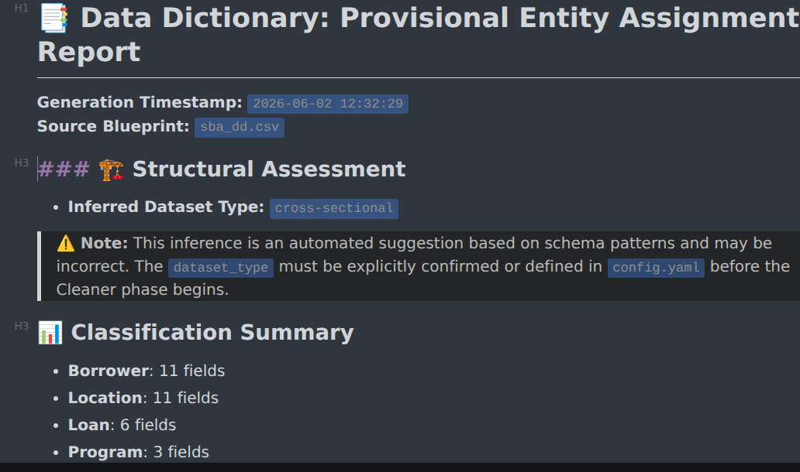
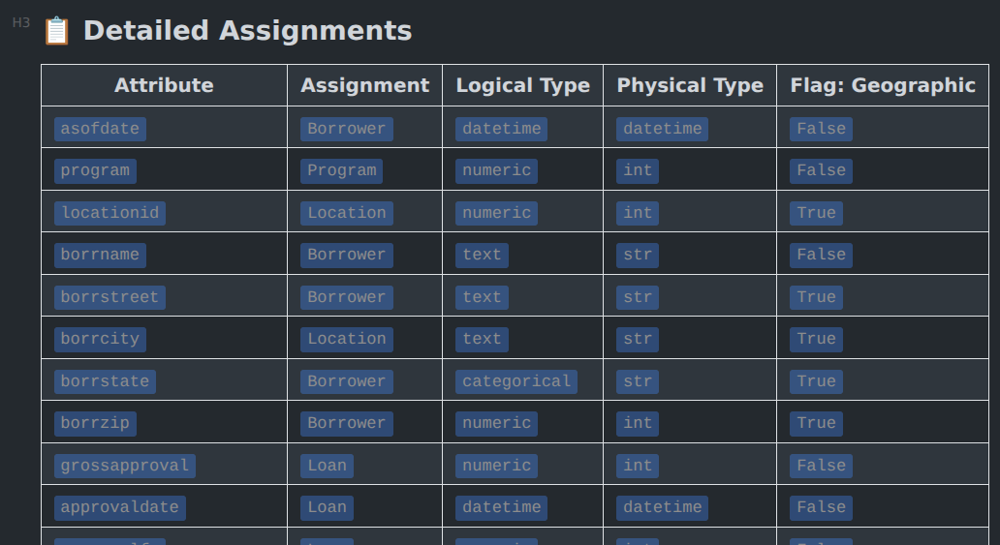
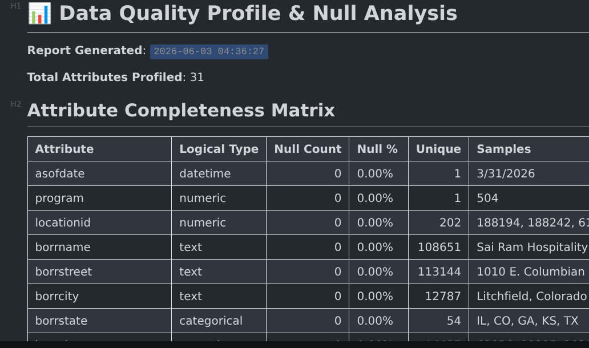
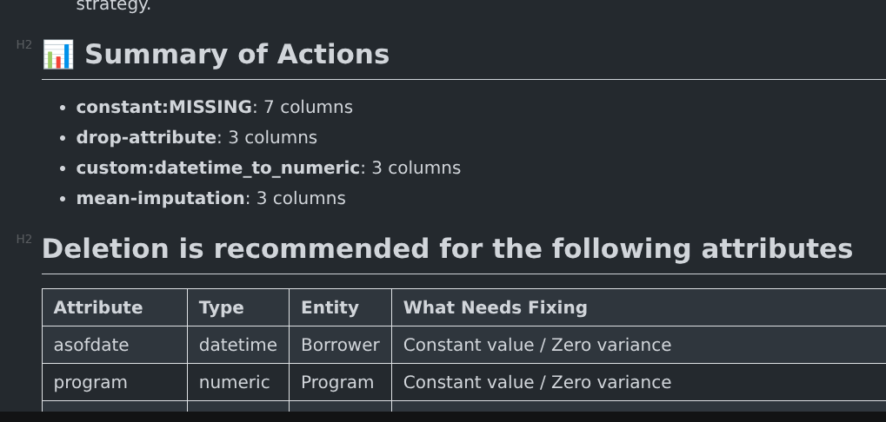

## Overview

This document provides a practical walkthrough of how to use `dd_parser_cleaner` and demonstrates why it is useful.

## The Dataset

The dataset used in this illustration is the SBA 7(a) loan dataset, available from government data catalogs. For background, see [this page](https://www.sba.gov/funding-programs/loans/7a-loans).

## Application of the Operational Recipe

The operational recipe for `dd_parser_cleaner` is as follows:

1. **Install**: Run `pip install dd-parser-cleaner`.
2. **Initialize**: Run `init-workspace` to build the KMDS directory structure.
3. **Locate**: Run `location-helper` for guidance on where to place data files and documents.
4. **Populate**: Move source files to `data/`, `data_dictionary/`, and `documents/`.
5. **Bootstrap**: Run `bootstrap-config` to generate `provisional_config.yaml` (then save it as `config.yaml`).
6. **Classify**: Run `classify-entities` to synchronize metadata and tag entities.
7. **Clean**: Run `clean-dataset --action full` to execute the diagnostic pipeline.
8. **Handshake**: Review `parser_cleaner_handshake.md` for schema verification.
9. **Baseline**: Review the Null Profile to understand raw data conditions.
10. **Recommendations**: Review `cleaning_recommendations.md` for AI-driven insights.
11. **Access**: Use the example notebook to load the Clean Baseline dataset.
12. **Modify**: Implement domain-specific cleaning and featurization in your notebook.

The first 7 steps are already completed, and we have an [example notebook](../notebooks/clean_sba_dataset.ipynb) that demonstrates steps 11 and 12. In the next section, we review the outputs that support this analysis.

## Working with What `dd_parser_cleaner` Generates

The goal is to use the skeleton raw data file generated by `dd_parser_cleaner`, along with the semantic information captured by the tool, to produce a dataset ready for featurization. In this process, we use semantic annotations and generated recommendations to organize the workflow, and we use a coding agent to build the pipeline from cleaner output to featurization-ready input.

Featurization is a separate module and currently a work in progress. It builds on the output produced in this exercise.

### The Handshake Document

The parser is the component that ingests the data dictionary and related documentation and produces the initial outputs in this package. See the `Parser` section of the [user guide](https://github.com/rajivsam/dd-parser-cleaner/blob/main/USER_GUIDE.md) for details on parser structure and outputs.

There are a few key things to review in the handshake document:

* The timestamp indicating when the report was generated and which data dictionary it used.
* The inferred dataset type. Based on attribute definitions and your use-case description, the parser infers whether your dataset is `longitudinal`, `cross-sectional`, or `panel`. This is an inference and should be validated by you. If it is incorrect, update it in `config.yaml`. As with all ML-generated output, review for possible mistakes.
* The semantic entities identified in the data file, based on the documentation you provided, the data dictionary, and the LLM grounding/prompting configuration.

A screenshot is shown below.



The content related to the first three observations is shown above. Additional important items are listed below.

* **Data bucket assignment**: Attribute names in the data dictionary are reconciled against headers in the raw data file. The raw data file header is treated as the authoritative version for downstream analysis. The parser uses a standard matching algorithm, so minor naming differences are handled automatically. Reconciliation produces three outcomes:
* **Orphans in the data dictionary**: Attributes present in the data dictionary but absent in the raw data file.
* **Orphans in the data file**: Attributes present in the raw data file but absent in the data dictionary.
* **Common pool**: Attributes present in both sources with clear documentation. This is the *only* attribute set that moves forward into the cleaning phase. If you want an attribute included downstream, document it in the data dictionary.

The purpose of this section is to give the analyst a clear view of documentation coverage and gaps. The corrective action is usually obvious from the bucket assignment.

Another useful view from the handshake document is shown below.



The key feature here is **entity tagging**. In this example, we want to capture geographic entities so they can be featurized through a dedicated downstream pipeline. You can use the agent user guide and the [config user guide](https://github.com/rajivsam/dd-parser-cleaner/blob/main/documents/config_setup.md) to define additional entities for custom featurization pipelines.

Common examples include textual descriptions, images, and video files. The parser tags matching fields under the configured entity type, and you can filter these fields during featurization and route them through a specialized pipeline. In this example, we do that for geographic attributes.

The table also includes an inferred logical type for each attribute. These logical types align with common tabular featurization categories: categorical, datetime, text, and numeric. This enables downstream modules to apply type-specific strategies. For example, categorical features may use a `missing` category, while numeric or dense representations may use autoencoder-based approaches.

The provisional entity assignment is not used in the immediate examples that follow. However, it is useful for graph-based analysis because it supports mapping relational data into a graph topology.

This concludes the handshake-document walkthrough. The cleaner uses this document as a source of truth for the cleaning stage.

### Cleaner - null profile

After the parser runs (``` classify-entities```), the cleaner can build on the output of the parser and start the cleaning process. After initialization, the first report generated is the _null profile report_. This is the summary of the dataset in the pristine condition, but after types have been inferred.

A snapshot of this report is shown below

{width=85%}

You should check the timestamp of generation and correlate that with the parser handshake time-stamp to infer if you are likely to looking at the most recent version of the data. The contents of the report are self-explanatory. It's meant to quickly get a broad picture of the data-quality and how the samples of the data look.

### Cleaner - Cleaning Recommendations

The next file for the user to review is the cleaning recommendations. This file is a set of recommended cleaning actions based on the data set review by the cleaner. These are based on statistical properties and are not made on the basis of suitablity for machine learning or the most relevant processing rule for the use case for which this dataset is developed.

A snapshot is shown below. _You should review these recommendations carefully_. This is the start of moving your dataset to the next stage in the process. You should select all or smaller set of recommended actions for application in the notebook processing step.

{width=85%}

### Notebook cleaning

The final step in applying `dd_parser_cleaner` is the notebook orchestration, where recommendations and domain rules are translated into executable cleaning logic. In this example, the `apply_migration()` method acts as the control point for the full preparation flow.

In this notebook, `apply_migration()` performs the following activities:

1. Derives a business-ready `loancondition` attribute from raw `loanstatus` values.
2. Filters records to the allowed outcome classes (`active`, `closed`, `distressed`).
3. Rectifies selected field types to string-backed categorical and synchronizes authoritative metadata in `df_tags`.
4. Applies validity checks and row-level exclusions (for example, date consistency logic).
5. Drops attributes selected from recommendations and domain review.
6. Handles categorical missing values using an explicit `MISSING` category.
7. Generates validation outputs (remaining-missing report and class imbalance ratio).

At this point, the repetitive implementation effort is largely complete. The remaining work is review and corrective action:

1. Inspect `df_final` and diagnostic outputs.
2. Confirm no unresolved missingness or schema mismatches remain.
3. Apply targeted overrides where domain context requires it.
4. Freeze the cleaned dataset as the handoff artifact for featurization.

Using a coding assistant accelerates this phase significantly by generating and iterating on boilerplate transformation logic, type handling, missing-value handlers, and validation/reporting code while you retain control over business decisions.

In this walkthrough, part of the boilerplate documentation and notebook scaffolding was also generated with coding-assistant support, reducing setup overhead and letting effort focus on domain-quality decisions before feature engineering.

### Exit Criteria Before Featurization

Use this checklist to confirm the cleaned dataset is ready for downstream feature engineering:

- `df_final` is generated successfully from `apply_migration()` with expected row and column counts.
- `loancondition` contains only the allowed classes (`active`, `closed`, `distressed`).
- `df_tags` remains authoritative and reflects final type decisions (`logical_type`, `physical_type`).
- No unhandled missing values remain in the post-migration missing-values report.
- Class distribution and imbalance ratio are reviewed and accepted for modeling strategy.
- Any domain overrides are documented, with rationale, in notebook markdown.
- The final cleaned output is frozen as the agreed input contract for featurization.
